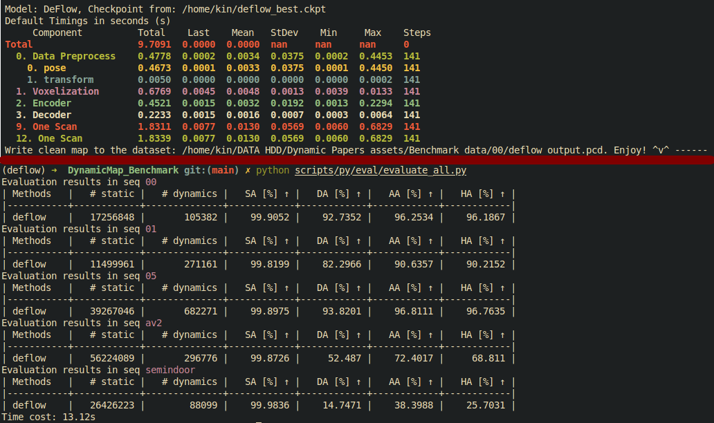

DeFlow: Decoder of Scene Flow Network in Autonomous Driving
---

[](https://arxiv.org/abs/2401.16122) 
[](https://paperswithcode.com/sota/scene-flow-estimation-on-argoverse-2?p=deflow-decoder-of-scene-flow-network-in) 
[](https://hkustconnect-my.sharepoint.com/:b:/g/personal/qzhangcb_connect_ust_hk/EXP_uXYmm_tItTWc8MafXHoB-1dVrMnvF1-lCzU1PXAvqQ?e=2FPfBS) 
[](https://youtu.be/bZ4uUv0nDa0)
[](https://zhuanlan.zhihu.com/p/706514747) 

Official task check: [https://github.com/KTH-RPL/DeFlow](https://github.com/KTH-RPL/DeFlow), Here is the inference for [DynamicMap Benchmark](https://github.com/KTH-RPL/DynamicMap_Benchmark).

## 0. Setup

**Environment**: Clone the repo and build the environment, check [detail installation](assets/README.md) for more information. [Conda](https://docs.conda.io/projects/miniconda/en/latest/)/[Mamba](https://github.com/mamba-org/mamba) is recommended.

```bash
git clone --recursive https://github.com/KTH-RPL/DeFlow.git
cd DeFlow
mamba env create -f environment.yaml
```

CUDA package (need install nvcc compiler), the compile time is around 1-5 minutes:
```bash
mamba activate deflow
# CUDA already install in python environment. I also tested others version like 11.3, 11.4, 11.7, 11.8 all works
cd assets/cuda/mmcv && python ./setup.py install && cd ../../..
```

Download data: [KTH-RPL/DynamicMap_Benchmark](https://github.com/KTH-RPL/DynamicMap_Benchmark?tab=readme-ov-file#dataset--scripts)
Or another environment setup choice is [Docker](https://en.wikipedia.org/wiki/Docker_(software)) which isolated environment, you can pull it by. 
If you have different arch, please build it by yourself `cd DeFlow && docker build -t zhangkin/seflow` by going through [build-docker-image](assets/README.md/#build-docker-image) section.
```bash
# option 1: pull from docker hub
docker pull zhangkin/seflow

# run container
docker run -it --gpus all -v /dev/shm:/dev/shm -v /home/kin/data:/home/kin/data --name deflow zhangkin/seflow /bin/zsh
# then `mamba activate seflow` python environment is ready to use
```

## 1. DynamicMap Inference

Download pre-trained weights for models are available in [huggingface](https://huggingface.co/kin-zhang/OpenSceneFlow). The weight is trained on Argoverse 2 Sensor dataset only, while DynamicMap Benchmark `av2` is from Argoverse 2 Map dataset. So no overfitting issue.

```bash
wget https://huggingface.co/kin-zhang/OpenSceneFlow/resolve/main/deflow_best.ckpt

python main.py checkpoint=/home/kin/deflow_best.ckpt dataset_path=/home/kin/data/00
python main.py checkpoint=/home/kin/deflow_best.ckpt dataset_path=/home/kin/data/av2
```


Running time & Result screenshot:


## Cite & Acknowledgements

```
@inproceedings{zhang2024deflow,
  author={Zhang, Qingwen and Yang, Yi and Fang, Heng and Geng, Ruoyu and Jensfelt, Patric},
  booktitle={2024 IEEE International Conference on Robotics and Automation (ICRA)}, 
  title={{DeFlow}: Decoder of Scene Flow Network in Autonomous Driving}, 
  year={2024},
  pages={2105-2111},
  doi={10.1109/ICRA57147.2024.10610278}
}
```

This implementation is based on codes from several repositories. Thanks to these authors who kindly open-sourcing their work to the community. Please see our paper reference part to get more information. 
Thanks to [Kyle Vedder (ZeroFlow)](https://github.com/kylevedder) who kindly discussed their results with us and HKUST Ramlab's member: Jin Wu who gave constructive comments on this work. 
The computations were enabled by the supercomputing resource Berzelius provided by National Supercomputer Centre at Linköping University and the Knut and Alice Wallenberg Foundation, Sweden.

❤️: [ZeroFlow](https://github.com/kylevedder/zeroflow), [NSFP](https://github.com/Lilac-Lee/Neural_Scene_Flow_Prior), [FastNSF](https://github.com/Lilac-Lee/FastNSF). Others good code style and tools: [forecast-mae](https://github.com/jchengai/forecast-mae), [kiss-icp](https://github.com/PRBonn/kiss-icp)
