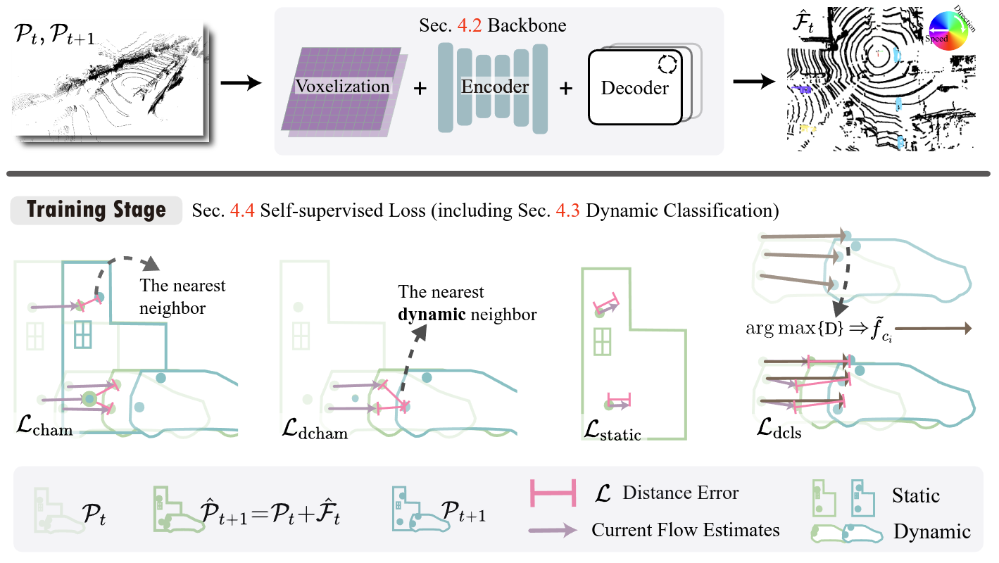

SeFlow: A Self-Supervised Scene Flow Method in Autonomous Driving
---

[](https://arxiv.org/abs/2407.01702)
[](https://paperswithcode.com/sota/self-supervised-scene-flow-estimation-on-1?p=seflow-a-self-supervised-scene-flow-method-in)
[](https://hkustconnect-my.sharepoint.com/:b:/g/personal/qzhangcb_connect_ust_hk/EWyWD-tAX4xIma5U7ZQVk9cBVjsFv0Y_jAC2G7xAB-w4cg?e=c3FbMg) 
[](https://youtu.be/fQqx2IES-VI)



2024/07/16 17:18: Most of codes already uploaded and tested. You can to try training directly by [downloading](https://zenodo.org/records/13744999) demo data or pretrained weight for evaluation. 
The process script will be public when the paper is published officially. 

Pre-trained weights for models are available in [Zenodo](https://zenodo.org/records/13744999) link. Check usage in [2. Evaluation](#2-evaluation) or [3. Visualization](#3-visualization).

Task: __Self-Supervised__ Scene Flow Estimation in Autonomous Driving. No human-label needed. Real-time inference (15-20Hz in RTX3090).

We directly follow our previous work [code structure](https://github.com/KTH-RPL/DeFlow), so you may want to start from the easier one with supervised learning first: Try [DeFlow](https://github.com/KTH-RPL/DeFlow). Then you will find this is simple to you (things about how to train under self-supervised). Here are **Scripts** quick view in this repo:

- `dataprocess/extract_*.py` : pre-process data before training to speed up the whole training time. 
  [Dataset we included now: Argoverse 2 and Waymo.  more on the way: Nuscenes, custom data.]
  
- `process.py`: process data with save dufomap, cluster labels inside file. Only needed once for training.

- `train.py`: Train the model and get model checkpoints. Pls remember to check the config.

- `eval.py` : Evaluate the model on the validation/test set. And also output the zip file to upload to online leaderboard.

- `save.py` : Will save result into h5py file, using [tool/visualization.py] to show results with interactive window.

<details> <summary>🎁 <b>One repository, All methods!</b> </summary>
<!-- <br> -->
You can try following methods in our code without any effort to make your own benchmark.

- [x] [SeFlow](https://arxiv.org/abs/2407.01702) (Ours 🚀): ECCV 2024
- [x] [DeFlow](https://arxiv.org/abs/2401.16122) (Ours 🚀): ICRA 2024
- [x] [FastFlow3d](https://arxiv.org/abs/2103.01306): RA-L 2021
- [x] [ZeroFlow](https://arxiv.org/abs/2305.10424): ICLR 2024, their pre-trained weight can covert into our format easily through [the script](tools/zerof2ours.py).
- [ ] [NSFP](https://arxiv.org/abs/2111.01253): NeurIPS 2021, faster 3x than original version because of [our CUDA speed up](assets/cuda/README.md), same (slightly better) performance. Done coding, public after review.
- [ ] [FastNSF](https://arxiv.org/abs/2304.09121): ICCV 2023. Done coding, public after review.
<!-- - [ ] [Flow4D](https://arxiv.org/abs/2407.07995): 1st supervise network in the new leaderboard. Done coding, public after review. -->
- [ ] ... more on the way

</details>

💡: Want to learn how to add your own network in this structure? Check [Contribute](assets/README.md#contribute) section and know more about the code. Fee free to pull request!

## 0. Setup

**Environment**: Same to [DeFlow](https://github.com/KTH-RPL/DeFlow). And even lighter here with extracting mmcv module we needed into cuda assets.

```bash
git clone --recursive https://github.com/KTH-RPL/SeFlow.git
cd SeFlow && mamba env create -f environment.yaml
```

CUDA package (need install nvcc compiler), the compile time is around 1-5 minutes:
```bash
mamba activate seflow
# CUDA already install in python environment. I also tested others version like 11.3, 11.4, 11.7, 11.8 all works
cd assets/cuda/mmcv && python ./setup.py install && cd ../../..
cd assets/cuda/chamfer3D && python ./setup.py install && cd ../../..
```

Or you always can choose [Docker](https://en.wikipedia.org/wiki/Docker_(software)) which isolated environment and free yourself from installation, you can pull it by. 
If you have different arch, please build it by yourself `cd SeFlow && docker build -t zhangkin/seflow` by going through [build-docker-image](https://github.com/KTH-RPL/DeFlow/blob/main/assets/README.md/#build-docker-image) section.
```bash
# option 1: pull from docker hub
docker pull zhangkin/seflow

# run container
docker run -it --gpus all -v /dev/shm:/dev/shm -v /home/kin/data:/home/kin/data --name seflow zhangkin/seflow /bin/zsh
```

## 1. Run & Train

Note: Prepare raw data and process train data only needed run once for the task. No need repeat the data process steps till you delete all data. We use [wandb](https://wandb.ai/) to log the training process, and you may want to change all `entity="kth-rpl"` to your own entity.

### Data Preparation

Check [dataprocess/README.md](dataprocess/README.md#argoverse-20) for downloading tips for the raw Argoverse 2 dataset. Or maybe you want to have the **mini processed dataset** to try the code quickly, We directly provide one scene inside `train` and `val`. It already converted to `.h5` format and processed with the label data. 
You can download it from [Zenodo](https://zenodo.org/records/13744999/files/demo_data.zip) and extract it to the data folder. And then you can skip following steps and directly run the [training script](#train-the-model).

```bash
wget https://zenodo.org/record/12751363/files/demo_data.zip
unzip demo_data.zip -p /home/kin/data/av2
```

#### Prepare raw data 

Checking more information (step for downloading raw data, storage size, #frame etc) in [dataprocess/README.md](dataprocess/README.md). Extract all data to unified h5 format. 
[Runtime: Normally need 10 mins finished run following commands totally in my desktop, 45 mins for the cluster I used]
```bash
python dataprocess/extract_av2.py --av2_type sensor --data_mode train --argo_dir /home/kin/data/av2 --output_dir /home/kin/data/av2/preprocess_v2
python dataprocess/extract_av2.py --av2_type sensor --data_mode val --mask_dir /home/kin/data/av2/3d_scene_flow
python dataprocess/extract_av2.py --av2_type sensor --data_mode test --mask_dir /home/kin/data/av2/3d_scene_flow
```

#### Process train data

Process train data for self-supervised learning. Only training data needs this step. [Runtime: Normally need 15 hours for my desktop, 3 hours for the cluster with five available nodes parallel running.]

```bash
python process.py --data_dir /home/kin/data/av2/preprocess_v2/sensor/train --scene_range 0,701
```

### Train the model

Train SeFlow needed to specify the loss function, we set the config of our best model in the leaderboard. [Runtime: Around 11 hours in 4x A100 GPUs.]

```bash
python train.py model=deflow lr=2e-4 epochs=9 batch_size=16 loss_fn=seflowLoss "add_seloss={chamfer_dis: 1.0, static_flow_loss: 1.0, dynamic_chamfer_dis: 1.0, cluster_based_pc0pc1: 1.0}" "model.target.num_iters=2" "model.val_monitor=val/Dynamic/Mean"
```

Or you can directly download the pre-trained weight from [Zenodo](https://zenodo.org/records/13744999/files/seflow_best.ckpt) and skip the training step. 

### Other Benchmark Models

You can also train the supervised baseline model in our paper with the following command. [Runtime: Around 10 hours in 4x A100 GPUs.] 
```bash
python train.py model=fastflow3d lr=4e-5 epochs=20 batch_size=16 loss_fn=ff3dLoss
python train.py model=deflow lr=2e-4 epochs=20 batch_size=16 loss_fn=deflowLoss
```

> [!NOTE]  
> You may found the different settings in the paper that is all methods are enlarge learning rate to 2e-4 and decrease the epochs to 20 for faster converge and better performance. 
> However, we kept the setting on lr=2e-6 and 50 epochs in (SeFlow & DeFlow) paper experiments for the fair comparison with ZeroFlow where we directly use their provided weights. 
> We suggest afterward researchers or users to use the setting here (larger lr and smaller epoch) for faster converge and better performance.

## 2. Evaluation

You can view Wandb dashboard for the training and evaluation results or upload result to online leaderboard.

Since in training, we save all hyper-parameters and model checkpoints, the only thing you need to do is to specify the checkpoint path. Remember to set the data path correctly also.

```bash
# downloaded pre-trained weight, or train by yourself
wget https://zenodo.org/records/13744999/files/seflow_best.ckpt

# it will directly prints all metric
python eval.py checkpoint=/home/kin/seflow_best.ckpt av2_mode=val

# it will output the av2_submit.zip or av2_submit_v2.zip for you to submit to leaderboard
python eval.py checkpoint=/home/kin/seflow_best.ckpt av2_mode=test leaderboard_version=1
python eval.py checkpoint=/home/kin/seflow_best.ckpt av2_mode=test leaderboard_version=2
```

And the terminal will output the command for you to submit the result to the online leaderboard. You can follow [this section for evalai](https://github.com/KTH-RPL/DeFlow?tab=readme-ov-file#2-evaluation).

Check all detailed result files (presented in our paper Table 1) in [this discussion](https://github.com/KTH-RPL/DeFlow/discussions/2).

## 3. Visualization

We provide a script to visualize the results of the model also. You can specify the checkpoint path and the data path to visualize the results. The step is quickly similar to evaluation.

```bash
python save.py checkpoint=/home/kin/seflow_best.ckpt dataset_path=/home/kin/data/av2/preprocess_v2/sensor/vis

# The output of above command will be like:
Model: DeFlow, Checkpoint from: /home/kin/model_zoo/v2/seflow_best.ckpt
We already write the flow_est into the dataset, please run following commend to visualize the flow. Copy and paste it to your terminal:
python tools/visualization.py --res_name 'seflow_best' --data_dir /home/kin/data/av2/preprocess_v2/sensor/vis
Enjoy! ^v^ ------ 

# Then run the command in the terminal:
python tools/visualization.py --res_name 'seflow_best' --data_dir /home/kin/data/av2/preprocess_v2/sensor/vis
```

https://github.com/user-attachments/assets/f031d1a2-2d2f-4947-a01f-834ed1c146e6


## Cite & Acknowledgements

```
@article{zhang2024seflow,
  author={Zhang, Qingwen and Yang, Yi and Li, Peizheng and Andersson, Olov and Jensfelt, Patric},
  title={SeFlow: A Self-Supervised Scene Flow Method in Autonomous Driving},
  journal={arXiv preprint arXiv:2407.01702},
  year={2024}
}
@inproceedings{zhang2024deflow,
  author={Zhang, Qingwen and Yang, Yi and Fang, Heng and Geng, Ruoyu and Jensfelt, Patric},
  booktitle={2024 IEEE International Conference on Robotics and Automation (ICRA)}, 
  title={{DeFlow}: Decoder of Scene Flow Network in Autonomous Driving}, 
  year={2024},
  pages={2105-2111},
  doi={10.1109/ICRA57147.2024.10610278}
}
```

💞 Thanks to RPL member: [Li Ling](https://www.kth.se/profile/liling) helps revise our SeFlow manuscript. Thanks to [Kyle Vedder](https://kylevedder.github.io), who kindly opened his code (ZeroFlow) including pre-trained weights, and discussed their result with us which helped this work a lot. 

This work was partially supported by the Wallenberg AI, Autonomous Systems and Software Program (WASP) funded by the Knut and Alice Wallenberg Foundation and Prosense (2020-02963) funded by Vinnova. 
The computations were enabled by the supercomputing resource Berzelius provided by National Supercomputer Centre at Linköping University and the Knut and Alice Wallenberg Foundation, Sweden.

❤️: [DeFlow](https://github.com/KTH-RPL/DeFlow), [BucketedSceneFlowEval](https://github.com/kylevedder/BucketedSceneFlowEval)

